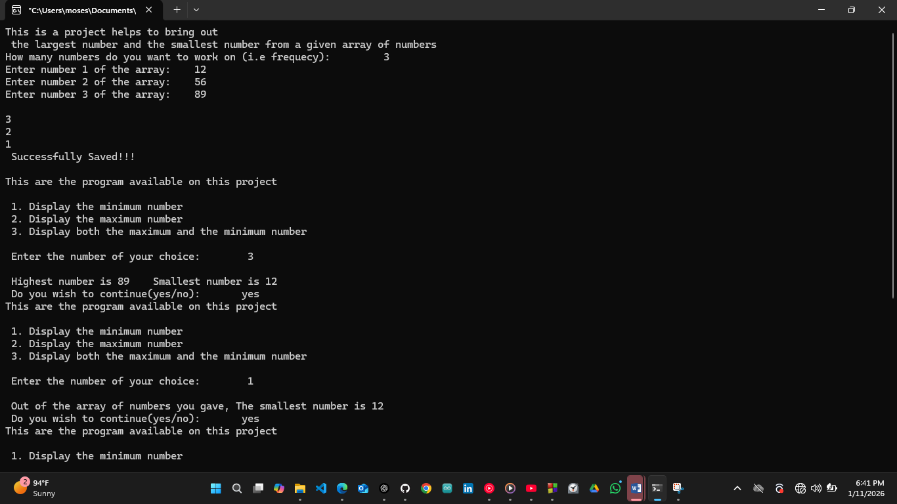

# Maximum and Minimum Finder Header – C Project

## Overview
This project is about using header files in C to work with arrays. 
The program helps to find the smallest number and the largest number from a given array of numbers. 
The code is split into a main file, a header file, and a source file to make it clean and reusable.

## Project Description
This is a simple array-based program written in C.
- The user enters how many numbers they want to work on.
- The user then enters the numbers into an array.
- The main file controls user input, menu display, and program flow.
- The header file contains the function declarations.
- The source file contains the logic for finding the minimum and maximum values.

- After saving the numbers, the program shows a menu where the user can choose to display the smallest number, the largest number, or both. The program can repeat based on user choice.

## Project Structure
main.c → handles user input, menu, and program loop [CLICK HERE FOR THE CODE](Source_Code/main.c)
maxmin.h → contains function declarations and macros [CLICK HERE FOR THE CODE](Header_File/maxmin.c)
maxmin.c → contains logic for finding minimum and maximum values [CLICK HERE FOR THE CODE](Source_code/maxmin.c)

## Why Header Files
I used header files so the minimum and maximum functions can be reused in other projects. 
The functions are declared in the header file and defined in the source file. 
Include guards (#ifndef, #define, #endif) are used to prevent multiple inclusion errors.

- This project helped me understand how multiple C files work together.

## How the Code Works
- The program starts from the main() function.
- Standard libraries and the custom header file are included.
- The user enters the number of elements in the array.
- The user inputs the array values.
- A short countdown confirms the data is saved.
- A menu is displayed to the user.
- The user selects an option.
- Main calls the minimum or maximum function from the source file.
- The result is printed to the screen.
- The program asks if the user wants to continue.
- If yes, the program repeats. If no, the program ends.

## What I Learned
- How to work with arrays in C
- How to find minimum and maximum values
- How to split code into main, header, and source files
- How to use header files for reusable code
- How to control program flow using menus and loops

## Images / Demo Video

[Click Here for the Demonstration Video](videos/max_min_finder_header_project_on_11th_January_2026.mp4)

## Embedded Systems Connection
In embedded systems, finding minimum and maximum values is useful for sensor data analysis. For example, temperature sensors, voltage monitoring, or motor speed control systems often need to know the highest and lowest values to make decisions.
